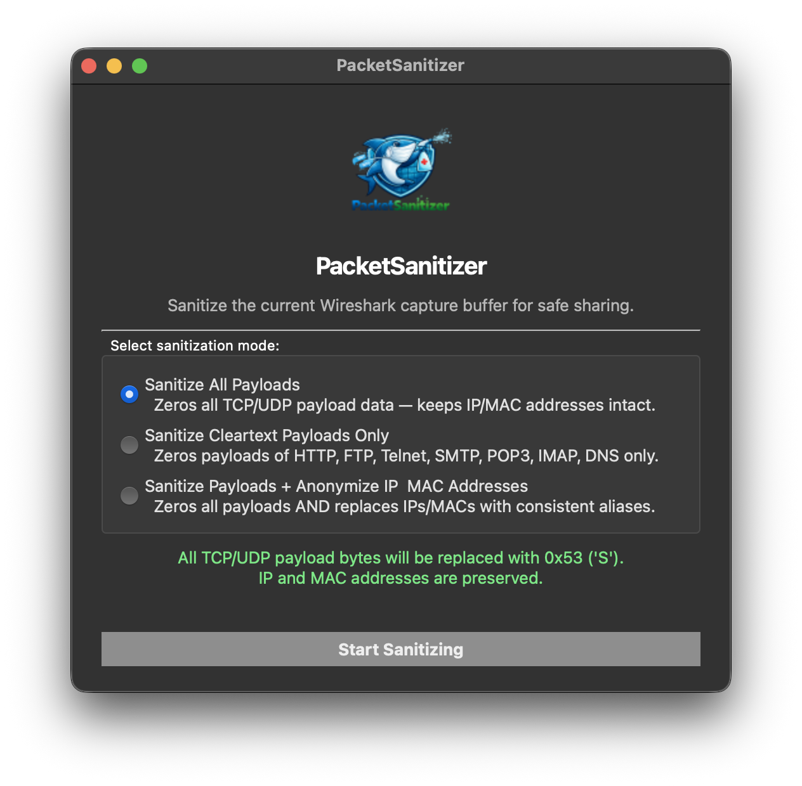
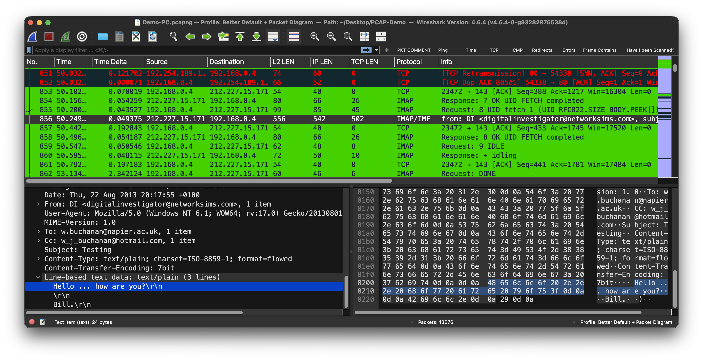
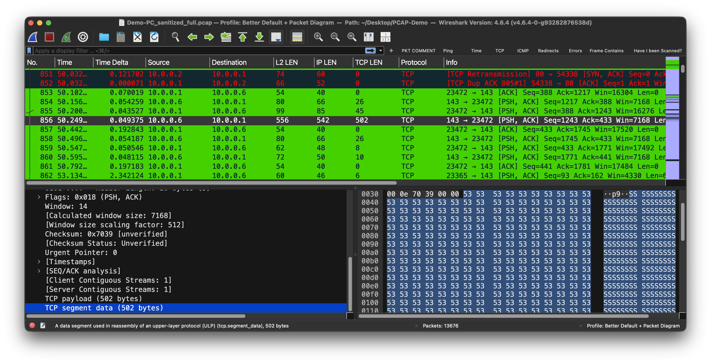

# PacketSanitizer

<p align="center">
  
</p>

<p align="center">
  
  
  
  
</p>

A native Wireshark epan plugin for sanitizing PCAP/PCAPNG files for safe sharing outside organizations.

## Screenshots

### Menu



Access the plugin via **Tools → PacketSanitizerPro → Open PacketSanitizerPro…**

### Before Sanitizing



### After Sanitizing



## Description

PacketSanitizer is a native C plugin that integrates directly into Wireshark's engine — no Python, no Lua, no external dependencies. It sanitizes packet capture files at wire speed with three modes to suit different security needs:

1. **Sanitize All Payload** — Zeros all TCP/UDP/ICMP payloads while preserving IP and MAC addresses
2. **Sanitize Clear Text Payload** — Only sanitizes payloads from clear-text protocols (HTTP, FTP, Telnet, SMTP, POP3, IMAP, DNS), leaving encrypted traffic untouched
3. **Sanitize Payload and IP & MAC Addresses** — Complete sanitization including all payloads and full IP/MAC address anonymization

### Sanitization Features

- **Anonymize IP addresses** — Replaces all IPs with deterministic 10.0.x.y addresses; same original IP always maps to the same anonymized IP (mode 3 only)
- **Anonymize MAC addresses** — Replaces all MACs with locally administered 02:00:00:00:00:XX addresses (mode 3 only)
- **Sanitize payloads** — Replaces payload data with a recognizable pattern (0x5341 = "SA" = "Sanitized") while preserving packet size
- **Preserve structure** — Maintains full packet structure, port numbers, and timing for valid analysis after sanitization
- **IGMP passthrough** — IGMP packets are left completely untouched
- **Checksum recomputation** — IP, TCP, and UDP checksums are recalculated after modification

The original file is preserved; a sanitized copy is created with a mode-specific suffix.

## Installation

### Quick Install (Recommended)

Automated installers check prerequisites and install the plugin automatically.

#### macOS (Universal — Intel + Apple Silicon)

```bash
cd installer/macos-universal
chmod +x install.sh && ./install.sh
```

#### Linux (x86_64)

```bash
cd installer/linux-x86_64
chmod +x install.sh && ./install.sh
```

#### Windows (x86_64)

```cmd
cd installer\windows-x86_64
install.bat
```

The installers will:
- Detect your Wireshark version and plugin directory
- Install to your personal plugin folder (no admin required by default)
- Offer uninstall if a previous version is detected

### Manual Installation

Copy the plugin binary to your Wireshark personal plugins directory:

**macOS/Linux:**
```bash
# Adjust version path to match your Wireshark (e.g. 4-6 or 4.6)
PLUGIN_DIR="$HOME/.local/lib/wireshark/plugins/4-6/epan"
mkdir -p "$PLUGIN_DIR"
cp packetsanitizer.so "$PLUGIN_DIR/"
```

**Windows:**
```powershell
$dir = "$env:APPDATA\Wireshark\plugins\4.6\epan"
New-Item -ItemType Directory -Force -Path $dir | Out-Null
Copy-Item packetsanitizer.dll "$dir\"
```

Restart Wireshark after installing.

## Usage

1. Open a PCAP or PCAPNG file in Wireshark
2. Go to **Tools → PacketSanitizer → Open PacketSanitizer…**
3. Select a sanitization mode in the dialog:
   - **Sanitize All Payload** — output: `*_sanitized_payload.pcap`
   - **Sanitize Clear Text Payload** — output: `*_sanitized_cleartext.pcap`
   - **Sanitize Payload and IP & MAC Addresses** — output: `*_sanitized_full.pcap`
4. Click **Start** — live status and progress are shown in the dialog
5. On completion, click **Load in Wireshark** to open the sanitized file directly

## Sanitization Modes

### Mode 1: Sanitize All Payload

| What | Detail |
|------|--------|
| Sanitized | All TCP, UDP, ICMP payloads |
| Preserved | IP addresses, MAC addresses, protocol headers, port numbers |
| Use case | Remove all payload data while keeping network topology visible |

### Mode 2: Sanitize Clear Text Payload

| What | Detail |
|------|--------|
| Sanitized | Payloads on clear-text ports: HTTP (80, 8000, 8008, 8080, 8888), FTP (20, 21), Telnet (23), SMTP (25, 587), POP3 (110, 995), IMAP (143, 993), DNS (53) |
| Preserved | Encrypted traffic payloads (HTTPS, SSH, TLS, etc.), IP and MAC addresses |
| Use case | Remove sensitive clear-text data while preserving encrypted traffic for analysis |

### Mode 3: Sanitize Payload and IP & MAC Addresses

| What | Detail |
|------|--------|
| Sanitized | All payloads + all IP addresses + all MAC addresses |
| Preserved | Protocol structure, port numbers, packet timing, conversation flows |
| Use case | Maximum sanitization for sharing outside your organization |

## How It Works

PacketSanitizer is a native Wireshark **epan plugin** — it links directly against `libwireshark` and `libwiretap`, with a Qt dialog for the UI.

**Processing loop:**
1. Opens the capture with the wtap read API
2. For each packet: parses Ethernet → VLAN → IPv4/IPv6 → TCP/UDP/ICMP
3. Applies the selected sanitization in-place on the raw packet buffer
4. Recomputes IP and transport checksums
5. Writes each packet to the output file via the wtap write API

**IP anonymization:** GHashTable keyed on the original `guint32` address; new IPs allocated from `10.0.0.0/8` in order of first appearance.

**MAC anonymization:** GHashTable keyed on a `guint64` (48-bit MAC in low bits); new MACs follow the `02:00:00:00:00:XX` locally administered pattern.

## Building from Source

PacketSanitizer is built as part of the Wireshark build tree.

1. Copy the `src/` directory to `<wireshark-src>/plugins/epan/packetsanitizer/`
2. Add the plugin to `CMakeListsCustom.txt`:
   ```cmake
   set(CUSTOM_PLUGIN_SRC_DIR plugins/epan/packetsanitizer)
   ```
3. Build Wireshark normally:
   ```bash
   cmake -DCMAKE_BUILD_TYPE=RelWithDebInfo ..
   make packetsanitizer
   ```

The plugin links against: `epan`, `wiretap`, `Qt6::Core`, `Qt6::Widgets`, `Qt6::Gui`.

### macOS Universal Binary

```bash
# arm64 slice
cmake -DCMAKE_OSX_ARCHITECTURES=arm64 -DQt6_DIR=~/Qt/6.9.3/macos/lib/cmake/Qt6 ..
make packetsanitizer

# x86_64 slice
arch -x86_64 /usr/local/opt/cmake/bin/cmake -DCMAKE_OSX_ARCHITECTURES=x86_64 -DQt6_DIR=~/Qt/6.9.3/macos/lib/cmake/Qt6 ..
arch -x86_64 make packetsanitizer

# Merge
lipo -create build-arm64/plugins/epan/packetsanitizer/packetsanitizer.so \
             build-x86_64/plugins/epan/packetsanitizer/packetsanitizer.so \
             -output installer/macos-universal/v.0.1.1/packetsanitizer.so
```

## File Structure

```
PacketSanitizerPro/
├── PacketSanitizer-Logo.png
├── LICENSE
├── README.md
├── screenshots/
│   ├── menu.png                    # Tools → PacketSanitizerPro menu
│   ├── before_sanitizing.png       # Wireshark capture before sanitizing
│   └── after_sanitizing.png        # Wireshark capture after sanitizing
├── src/
│   ├── CMakeLists.txt              # Build file (v.0.1.1); drop into WS plugin tree
│   ├── packetsanitizer_plugin.c/h  # proto_register, Tools menu entry
│   ├── sanitizer_engine.c/h        # wtap read/write loop, payload & address sanitization
│   ├── ui_bridge.cpp/h             # C-callable Qt bridge
│   ├── ui_main_window.cpp/h        # Qt QDialog: mode select, progress, result pages
│   ├── packetsanitizer.qrc         # Embedded logo resource
│   └── glibc_compat.c             # Linux: avoids GLIBC_2.38 symbol dependency
└── installer/
    ├── macos-universal/
    │   ├── install.sh              # macOS installer (Intel + Apple Silicon)
    │   └── v.0.1.1/
    │       └── packetsanitizer.so
    ├── linux-x86_64/
    │   ├── install.sh              # Linux installer
    │   └── v.0.1.1/
    │       └── packetsanitizer.so
    └── windows-x86_64/
        ├── install.bat             # Windows installer launcher
        ├── install.ps1             # Windows installer (PowerShell)
        └── v.0.1.1/
            └── packetsanitizer.dll
```

## Requirements

- Wireshark 4.6.x
- Qt 6.x runtime (bundled with the official Wireshark installer on macOS and Windows; install separately on Linux: `sudo apt install libqt6widgets6`)
- VC++ 2022 Redistributable on Windows

## Security Notes

The sanitized file removes sensitive data but still contains:
- Protocol headers and structure
- Packet timing information
- Port numbers and protocol types

Review the sanitized file before sharing to ensure it meets your organization's requirements.

## Acknowledgments

- **Wireshark development team** — for the outstanding epan plugin API, wtap read/write framework, and dissector infrastructure that made a native C implementation possible without reinventing the wheel
- **Wireshark community** — for years of documentation, examples, and open plugin source code that served as invaluable reference material
- **AI-Assisted** — yes (Claude by Anthropic) — used for native C plugin architecture, Qt UI design, cross-platform build system, installer scripting, and documentation

---

**Built with ❤️ for the network analysis community** — [github.com/netwho/PacketSanitizer](https://github.com/netwho/PacketSanitizerPro)

## License

GNU General Public License v2. See [LICENSE](LICENSE) for details.
